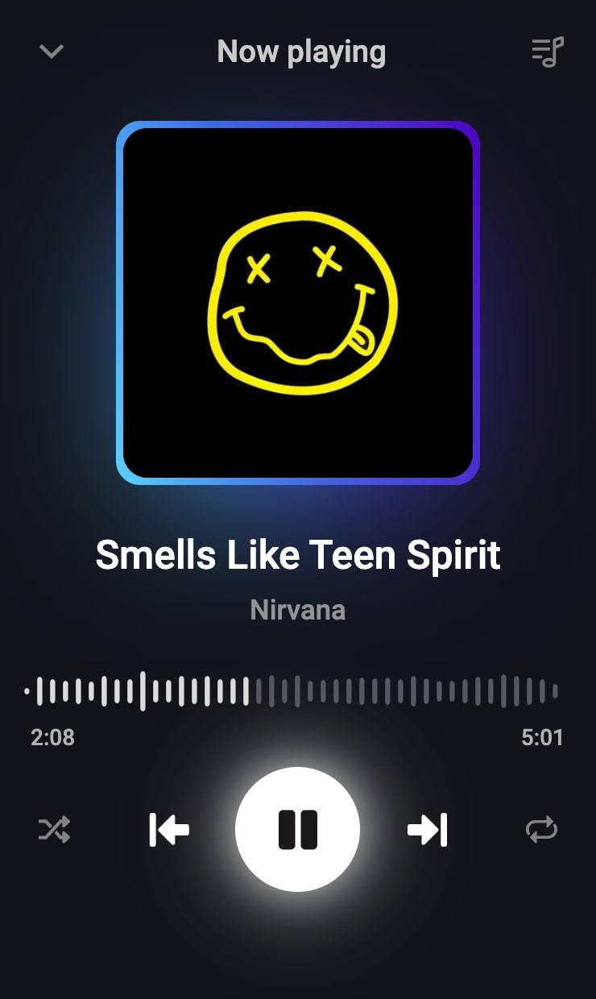

# Oasis Telegram Bot

Upload and save your favorite soundtracks



## Runtime requirements

Your machine must have [ffmpeg](https://ffmpeg.org/ffmpeg.html) and [ffprobe](https://ffmpeg.org/ffprobe.html)

```bash
ffmpeg -version # >= 4.4.2
```

and

```bash
ffprobe -version # >= 4.4.2
```

Next, you will need a [file server](https://github.com/Oasis-Music/file-server) urls that will serve audio and picture files.

For example:

```js
AUDIO_PATH=http://[your_url]/audio/[filename]
```

Put these values in the backend _`.env.dev`_ in the `COVER_PATH` and `AUDIO_PATH` variables.

Also the base schema of the DB is in _`backend/init/init.sql`_

## Launching

From relevant directories
Run these commands from the appropriate directories.
Also pre-specify `DB_*` variables in `.env.dev` to connect to Postgres

Client:

```bash
npm run dev
```

Backand:

```bash
make
```
